# Running System-1 Decision Models on SiMa.ai MLSoC Modalix

[Laya](https://github.com/NandhaKishorM/laya) is a family of non-autoregressive "System 1"
decision models: a ModernBERT-style encoder with a small decision head. A model takes a state
(text or JSON) and a typed question (`choice`, `score` or `noul`) and returns a probability
for each option in one forward pass, with no text generation.

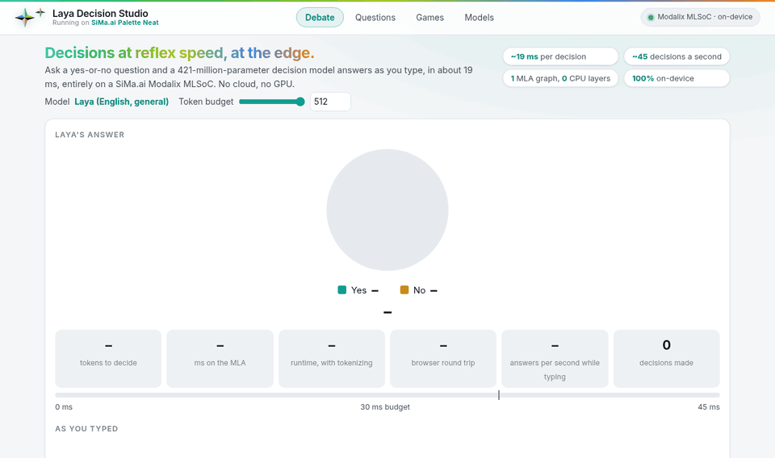

*The Debate page, recorded on a Modalix DevKit in real time: the model answers again on every
keystroke, 19 ms on the MLA each time.*

This repository compiles those models for the SiMa.ai Modalix MLA and runs them there:

- **`laya_sima/`** builds a checkpoint as one MLA graph on the LLiMa compiler framework
  (`sima_lmm`'s `BaseModel` + `OnnxBuilder`, the same base its Whisper encoder and vision
  towers use) and drives the same passes `llima-compile` does.
- **`clm_sima/`** does the same for a second kind of decision model,
  [CLM](#clm-a-second-kind-of-decision-model), whose encoder is the 8-billion-parameter
  Qwen3-8B: it becomes a chain of MLA graphs.
- **`runtime/`** is a standalone C++ runtime for the board. It uses only the LLiMa runtime
  library (`sima-lmm-dev`: MLA buffers, ELF loading, tokenizer).
- **`webapp/`** is **Neat Decision Studio**, an example web application on top of the runtime: live yes-or-no answers, a
  page for your own questions, seven games the models play in real time (with you in them,
  or against a language model), and a model manager.

Checkpoints and compiled artifacts are not in the repository. The compiled models are on
Hugging Face at [TDoSiMa/sima-laya](https://huggingface.co/TDoSiMa/sima-laya), where the app
downloads them from, and the Build section regenerates them.

## The demo

Everything below was recorded from the web app running on a Modalix DevKit, at the speed it
runs. Each page shows the time the MLA took for the decisions on screen.

**The landing page and the showcase.** The first screen is a question box and four ways in;
the showcase is the story as slides, with a decision made live on the board.

<table>
<tr>
<td width="50%">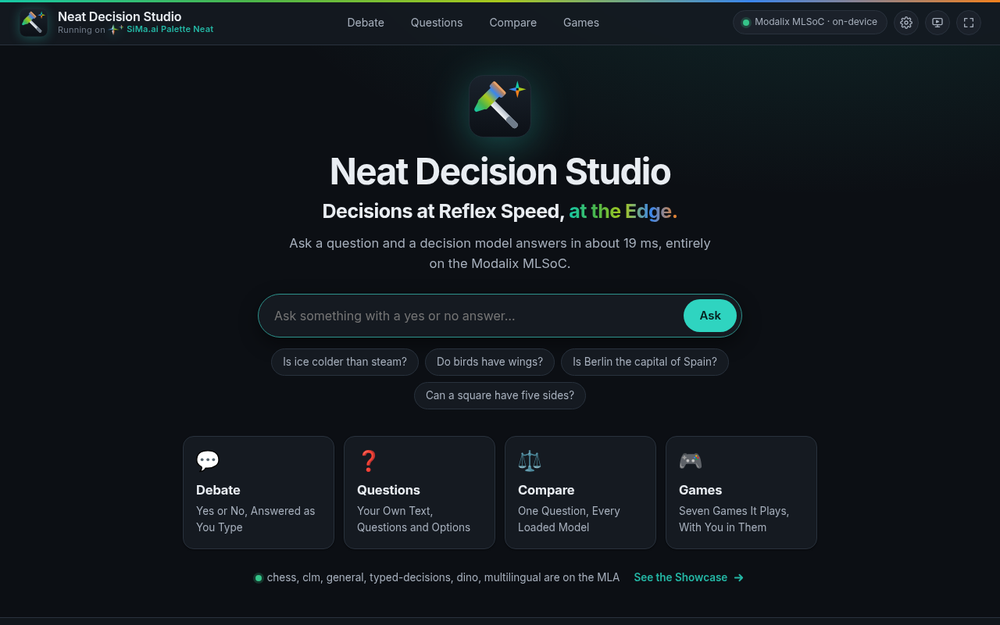</td>
<td width="50%">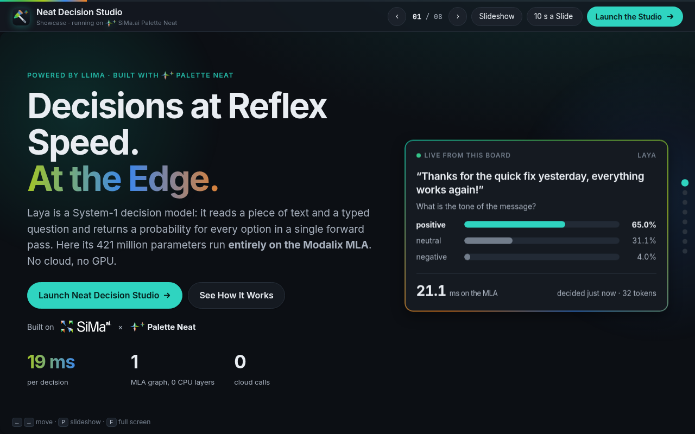</td>
</tr>
</table>

**Questions.** A state, and any number of typed questions about it with your own options; each
question is one forward pass.

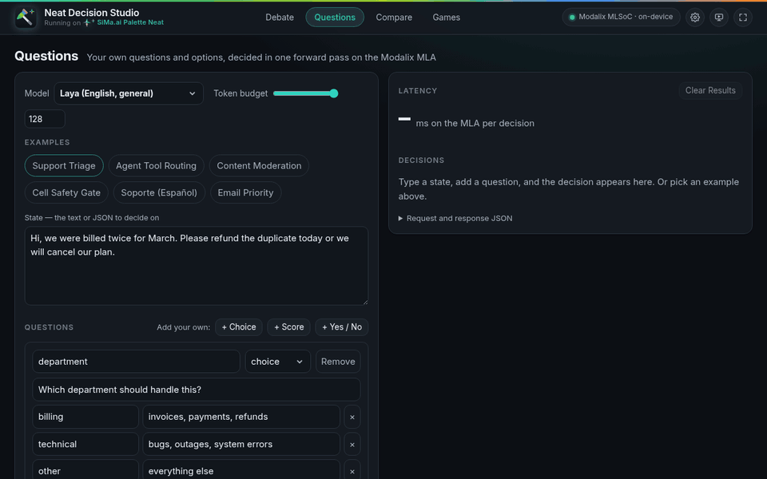

**Compare.** Several models can be on the MLA at once. Compare asks them all the same thing
at the same moment and sets their answers side by side: who agrees, who differs, how fast.
Here four models answer: three Layas and CLM, a decision model on an 8-billion-parameter
encoder.

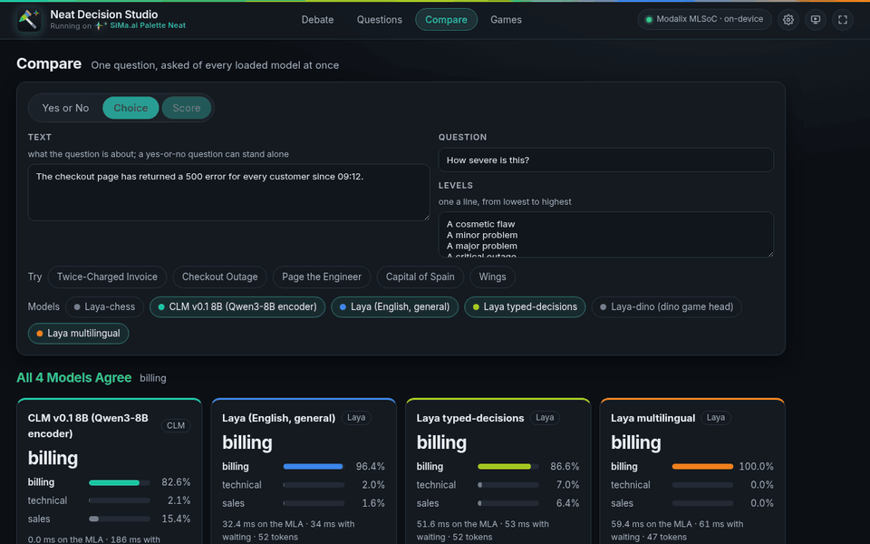

**Games.** In each game a model makes every decision, and the page shows what it was told
and how it chose. Any loaded model can take a seat, so two different models play each other.

<table>
<tr>
<td width="50%">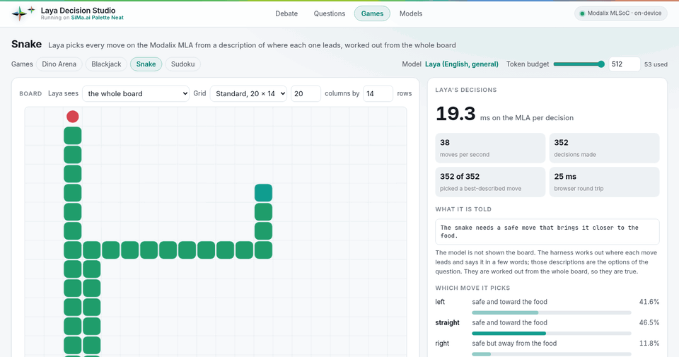<br>
<b>Snake.</b> One decision per move, among three moves described by where each leads. Here
Laya races Laya typed-decisions on the same course.</td>
<td width="50%">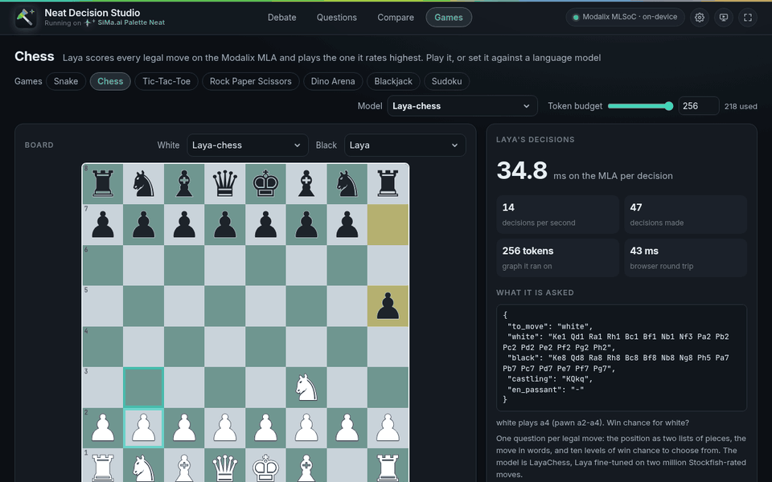<br>
<b>Chess.</b> One decision per legal move: its win chance. Laya-chess plays White against
the general Laya, with a running score under the board.</td>
</tr>
<tr>
<td>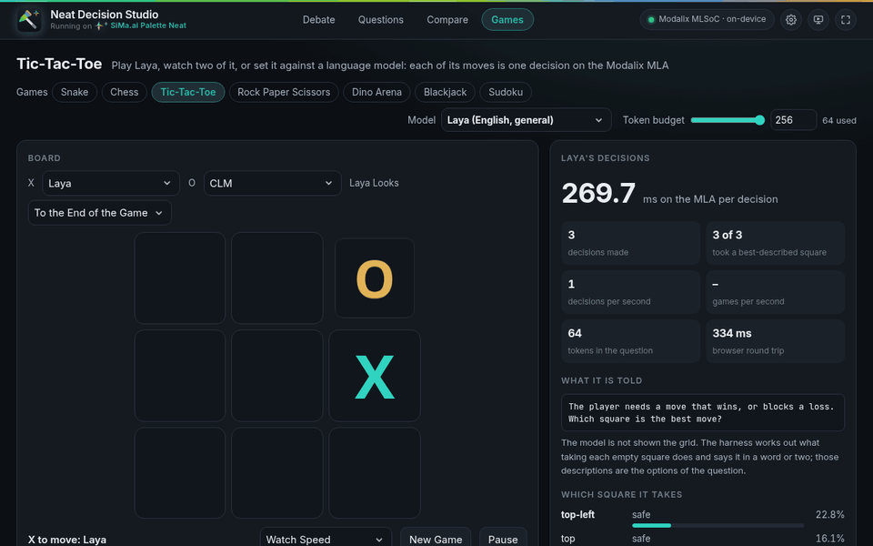<br>
<b>Tic-Tac-Toe.</b> Each move is one decision among the empty squares, described. Laya
plays X against CLM.</td>
<td>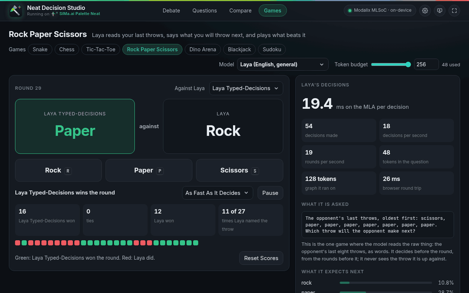<br>
<b>Rock Paper Scissors.</b> Each model reads the other's last throws, says what comes next
and plays what beats it.</td>
</tr>
<tr>
<td>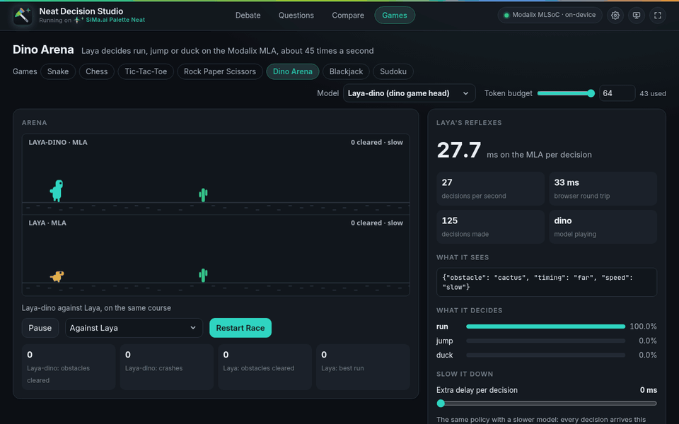<br>
<b>Dino Arena.</b> A decision head fine-tuned for the game picks run, jump or duck about 45
times a second; in the lower lane the general Laya tries the same course.</td>
<td>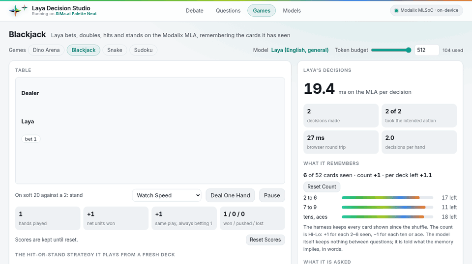<br>
<b>Blackjack.</b> The model bets, doubles, hits and stands, remembering the cards it has
seen. A second model sits at the same table.</td>
</tr>
<tr>
<td>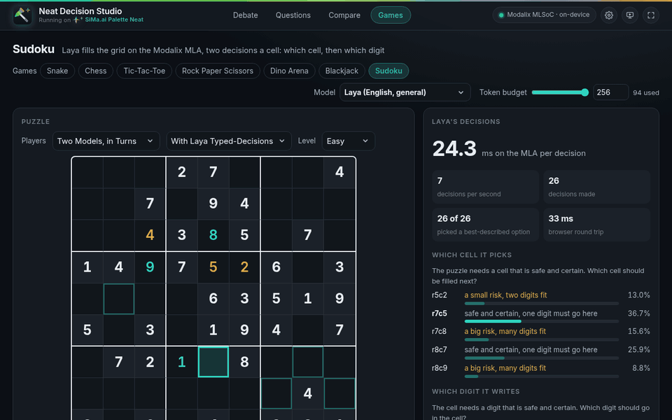<br>
<b>Sudoku.</b> Two decisions per cell: which cell is safe to fill, then which digit. Two
models take a cell each in turn.</td>
<td valign="top"><br>A person can take a seat in every one of them too, and in three the other side
can be a language model served by NEAT GenAI Studio.</td>
</tr>
</table>

**Settings.** The model manager is the gear in the header, on every page: what is on the
board (load, unload, delete), the MLA's memory with what this app and other programs hold,
Reset Accelerator, what Hugging Face has to download, and which version is running.

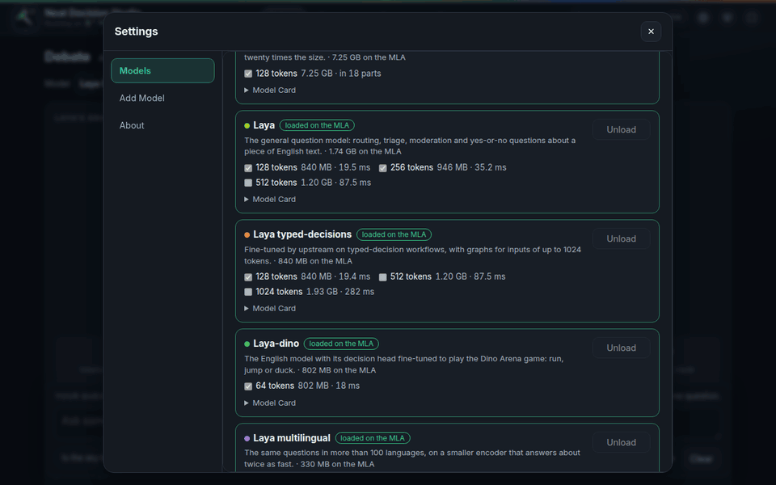

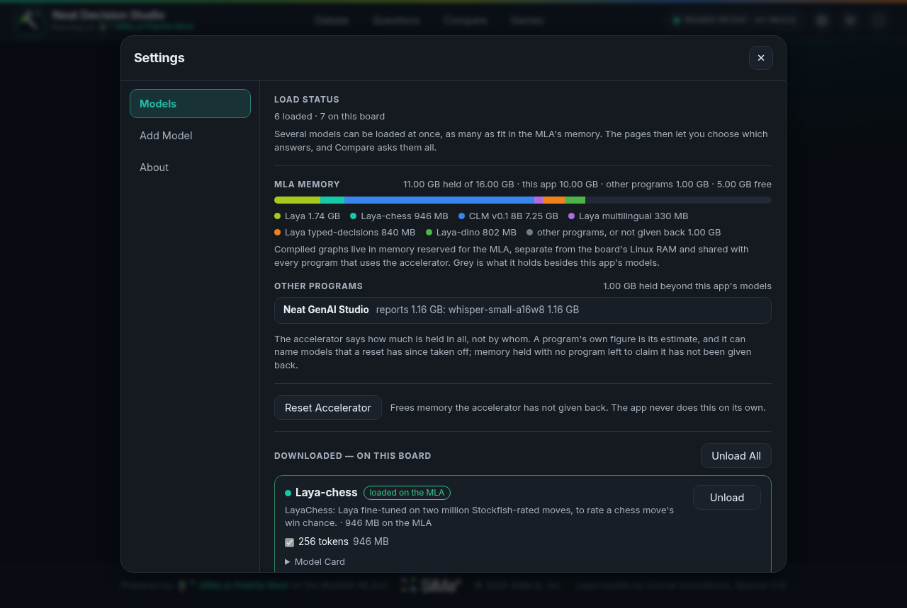

## Install

The quick way needs no compiler and no host: the runtime is built on the board, and the
compiled models are downloaded from Hugging Face by the app.

**What you need**

- A Modalix DevKit on the SDK's eLxr image, reachable on your network, with internet access
  for downloading models.
- The LLiMa runtime development package on the board (`sima-lmm-dev`, which the runtime
  links against for MLA buffers, ELF loading and the tokenizer): `sima-cli neat install llima`.
- `cmake`, `g++`, `python3` and the nlohmann JSON headers:
  `sudo apt install cmake g++ python3 nlohmann-json3-dev`. The web app uses only Python's
  standard library, so there is nothing to `pip install`.
- Room on the NVMe for the models, 0.7 to 4.4 GB each and 11.9 GB for all five. The root
  filesystem is too small for them.

**On the board**

```bash
ssh sima@<board-ip>
cd /media/nvme
git clone https://github.com/dotimothy/neat-decision-studio.git laya
cd laya
./setup.sh            # checks the prerequisites, builds the runtime, adds the shortcuts
./run.sh              # serves the demo at http://<board-ip>:8095 (afterwards also: neat-decision)
```

`setup.sh` goes through four things, in the manner of the other Neat demos (the Neat logo,
then a section each):

- **Environment**: the prerequisites above; it names the one that is missing.
- **Runtime**: builds the C++ runtime on the board.
- **Models**: lists the compiled models on the board. With none there and a person at the
  terminal, it shows what is on Hugging Face and asks which to download now (blank: later).
  `LAYA_MODELS="general dino" ./setup.sh` (or `all`) downloads without asking.
- **Shortcuts**: a `neat-decision` alias for `run.sh` in the shell's startup file, and, when the
  board has a desktop, a **Neat Decision Studio** icon on it (a hammer in the Palette Neat
  colours, `webapp/static/brand/neat-decision.svg`) and in the applications menu
  that starts the app and opens the board's browser on it. `--no-alias` and
  `--no-desktop-icon` leave them out.

Then, in a browser on any machine that can reach the board:

1. Open `http://<board-ip>:8095/models`: the app with **Settings** open (the gear in the
   header opens it on any page). With no model on the board yet, **Add Model** lists every
   model on Hugging Face.
2. Press **Download** on one. **Laya** (about 3 GB) is the general model the pages are
   written for; **Laya INT8** (about 0.7 GB) is the quickest to fetch; Dino Arena wants
   **Laya-dino**.
3. Press **Load** on it once it has arrived. It is on the MLA a few seconds later.
4. Open **Debate**, **Questions** or **Games**.

A clone is also the app directory: the built runtime, the downloaded models (`model/`,
`model-<name>/`) and the log stay out of git.

**Without git on the board, or from a development host**

```bash
git clone https://github.com/dotimothy/neat-decision-studio.git && cd neat-decision-studio
bin/laya-deploy --board sima@<board-ip>      # copies the runtime and web app to
                                             # /media/nvme/laya and runs setup.sh there
ssh sima@<board-ip> /media/nvme/laya/run.sh
```

Given a build directory, `bin/laya-deploy` also copies models you compiled yourself; see
[Build](#build).

**Running it**

`neat-decision` is `./run.sh`, from any directory, once setup has run and a new shell is open.

```bash
neat-decision                         # in the foreground; Ctrl-C stops it and unloads the model
nohup ./run.sh > webapp.log 2>&1 &   # or in the background
neat-decision --stop                  # stop a running app
neat-decision --port 9000             # another port
neat-decision --preload none          # start with nothing on the MLA (default: the general model, if present)
neat-decision --open-browser          # at the board: also open its browser on the demo
neat-decision --cli                   # the demo in the terminal instead (below)
neat-decision --version               # the Neat logo and the versions: firmware, Neat, neat-llima, neat-runtime, neat-decision
neat-decision update                  # the latest published version, with the runtime rebuilt (below)
./setup.sh --check                # with a general model on the board: load it and answer one question
```

**Updating**

`neat-decision update` (`./run.sh update`) brings the app to the latest published version. In
a clone of the repository it is `git pull --ff-only`. In a copy (what `bin/laya-deploy` makes,
or an unpacked download) it fetches the source from GitHub and puts it in place of the
directory's own, files a release dropped included. What belongs to the installation stays:
the models (`model/`, `model-*/`), the built runtime, the log and the reset token. Then it
rebuilds the runtime (`./setup.sh --runtime-only`), since the C++ has to match the source it
came with.

It does not go backwards: a board that was deployed from a development host can be ahead of
what is published, and then the update says so and changes nothing (`UPDATE_FORCE=1`
overrides). `DECISION_STUDIO_BRANCH` names another branch than `main`, `UPDATE_BUILD=0`
skips the rebuild. A running app keeps running the version it was started with; restart it
(`neat-decision --stop`, then `neat-decision`) to use the new one.

**In a terminal**

`neat-decision --cli` is the demo without a browser: a prompt where a line is a yes-or-no
question, and commands manage the models as Settings does. As on the Debate page, the
model decides again at every keystroke, and its answer is drawn under the line while it is
typed; Enter keeps it. It joins the app if one is running; otherwise it starts one for as long
as the prompt is open.

Started in a terminal, `neat-decision` opens with the Neat logo and the versions of what is
installed (read from the packages, so it does not wait for the `neat` command's online check),
and draws a loading bar while the start-up model goes onto the MLA.

```text
laya [general-int8] ▸ Is Berlin the capital of Spain?

  yes  █░░░░░░░░░░░░░░░░░░░░░░░░░░░    1.8%
  no   ███████████████████████████░   98.2%

  no  14.0 ms on the MLA · 27 tokens on the 128-token graph · 24 ms round trip

laya [general-int8] ▸ /state Production is down for every customer since 09:12.
laya [general-int8] · state ▸ /choice Which team owns this? | billing: invoices | platform: outages
laya [general-int8] · state ▸ /score How urgent is this? | not urgent | soon | blocking
laya [general-int8] · state ▸ /bench 100
```

| command | what it does |
|---|---|
| `/models` | every model, on the board or on Hugging Face |
| `/load [NAME] [128,512]`, `/unload [NAME\|all]` | put a model on the MLA beside any already there (no name: pick from a list), or take one off |
| `/use NAME`, `/compare QUESTION` | with several loaded: which one answers; or ask them all at once, a line a model |
| `/download NAME`, `/delete NAME` | fetch a model from Hugging Face with a progress bar, or remove one from the board |
| `/reset` | reset the accelerator (asks first): every model comes off the MLA, other applications' included |
| `/state TEXT` | the text the next questions are about; alone, back to plain questions |
| `/yesno Q`, `/choice Q \| A \| B`, `/score Q \| LOW \| HIGH` | the three kinds of question, about the state |
| `/budget N`, `/bench [N]`, `/json` | the token budget; time the last question N times; raw JSON answers |

`neat-decision --ask "Is the sky blue?"` answers once and exits, `--model NAME` loads a model
first, and questions piped in are answered one per line. The prompt is `webapp/cli.py`, which
uses only the app's HTTP API and Python's standard library.

To update, `git pull` (or run `bin/laya-deploy` again), then `./setup.sh`, and restart the app.
If a model fails to load with `MLA_LOAD_FAILED`, see the end of
[Run on the board](#run-on-the-board).

## Results

Measured on a Modalix DevKit (eLxr 2.1.3), weights and activations in bfloat16. Latency is one
decision, end to end inside the runtime (embedding lookup + MLA + decode), mean of 20-200 runs.
Every graph is a single MLA stage: the compiler reports `MLA: 1, A65: 0`.

| checkpoint | encoder | 64 | 128 | 256 | 512 | 1024 tokens |
|---|---|---|---|---|---|---|
| `laya` (English) | ModernBERT-large, 421M | 18.0 ms | **19.5 ms** | 35.2 ms | 87.5 ms | not trained for it |
| `laya-typed-decisions` | ModernBERT-large, 421M | | **19.4 ms** | | 87.5 ms | 282 ms |
| `laya-multilingual` | mmBERT-base, 322M | | **8.1 ms** | **15.3 ms** | 33.9 ms | 116.5 ms |
| `laya-dino` (game head) | ModernBERT-large, 421M | **18.0 ms** | | | | |
| `laya-chess` ([LayaChess](https://huggingface.co/datafreak/laya-chess)) | ModernBERT-large, 421M | | | 34.8 ms | | |

So the English models answer in under 30 ms for inputs up to 128 tokens (question, options
and state together), and the multilingual model up to 256 tokens. Longer graphs exist for long
inputs, above that budget.

Agreement with the fp32 PyTorch model on 100 decisions (20 states x 5 questions,
`tools/agreement.py`), 128-token graphs:

| checkpoint | weights | latency | same decision | probability drift (mean / p95 / max) |
|---|---|---|---|---|
| `laya` | bf16 | 19.5 ms | 100 / 100 | 0.010 / 0.030 / 0.16 |
| `laya` | int8 encoder MLP, rest bf16 | 16.4 ms | 97 / 100 | 0.016 / 0.061 / 0.11 |
| `laya` | int8 encoder, bf16 head | 14.8 ms | 98 / 100 | 0.022 / 0.070 / 0.20 |
| `laya` | int8 everything | 14.0 ms | 98 / 100 | 0.022 / 0.070 / 0.20 |
| `laya-typed-decisions` | bf16 | 19.4 ms | 99 / 100 | 0.006 / 0.018 / 0.03 |
| `laya-multilingual` | bf16 | 8.1 ms | 100 / 100 | 0.004 / 0.017 / 0.04 |

Things worth knowing before choosing what to compile:

- **Latency is mostly weight traffic, not sequence length.** Halving the sequence from 128 to
  64 tokens saves 1.5 ms; halving the weight bytes (int8) saves 5.5 ms.
- **Int8 weights trade decisions for speed.** `--int8_weights mlp|encoder` stores only the
  chosen encoder matrices as int8 inside the same single ELF. It is faster, but the decision
  flips come from the encoder, so keeping the head in bf16 does not win them back. Int8 uses
  no calibration here; calibrated quantization (GPTQ-style, as LLiMa's model zoo uses) is the
  untried next step. A 256-token int8 build crashed the compiler's own simulator, and int8
  broke the fine-tuned game head (28/30 states).
- **Graphs load into memory reserved for the MLA** (16 GB on the DevKit, separate from Linux
  RAM and shared by every MLA application). All four checkpoints, ten graphs and about 7.4 GB
  in total, were loaded at once.
- **The app keeps as many models loaded as fit**, each in its own runtime process (see
  Settings below).
- **Loading takes seconds.** About 3 s for one English graph, 6 s for all three, 9-10 s for
  the multilingual model (its 34 MB tokenizer and 393 MB embedding table dominate).
- **Each question is one forward pass.** A request with three questions takes three passes.
- **Zero-shot quality is the checkpoint's.** The port reproduces PyTorch's answers, including
  its wrong ones; upstream describes the base models as "a fast base to specialise".
- Tokenizing adds 1-2 ms on the A65 for a short ticket, outside the bench numbers above.

## Layout

```
laya_sima/            compiler package (runs in the Model Compiler venv)
  config.py           checkpoint -> LayaConfig
  weights.py          checkpoint tensors under the names OnnxBuilder asks for
  model.py            LayaModel(BaseModel): the graph
  hostio.py           the CPU side of the contract, in numpy (reference for runtime/)
  cli.py              laya-compile
clm_sima/             the same for CLM's encoder: Qwen3 layers as a chain of graphs
  config.py, weights.py, model.py, cli.py (clm-compile)
bin/laya-compile      wrapper that runs the CLI under the Model Compiler venv
bin/clm-compile       the same wrapper for clm_sima
bin/laya-deploy       copy models + runtime + web app to a board and set it up
runtime/              C++ runtime and `laya` CLI for the board
webapp/               example web app (stdlib Python server; question, games and model pages),
                      and cli.py, the same demo as a terminal prompt
  static/neat.css      the look shared by every page; brand.js builds the header, the footer
                       and the game switcher
  static/vendor/       chess.js 0.10.3, the rules of chess (Jeff Hlywa, BSD-2-Clause)
  static/brand/, fonts/ marks and fonts taken from SiMa.ai's NEAT GenAI Studio example
games/                per game: what the model is asked and why, and the reference policy
setup.sh, run.sh      board-side: build once, start the app, update it
docs/                 the recordings of the demo shown above
tools/                reference dump, ONNX check, board parity, agreement, I/O shape probe,
                      game-head training, and per game a board check and a simulation,
                      publish_hub.py, which uploads compiled models to Hugging Face, and for
                      CLM: clm_reference.py, clm_heads.py, clm_verify_onnx.py, clm_check.py
```

`models/`, `build/`, `.venv-ref/`, `.venv-train/` and `third_party/` are local and ignored by
git.

## How the graph is arranged

The graph uses LLiMa's token layout, NCHW with one token per W position:

| | tensor | shape | |
|---|---|---|---|
| in | `embeds` | (1, hidden, 1, S) | token embeddings (looked up on the CPU) |
| in | `global_mask` | (1, S, 1, S) | additive attention mask: padding |
| in | `local_mask` | (1, S, 1, S) | padding + ModernBERT's 64-token sliding window |
| in | `qtype` | (1, 16, 1, S) | question type, one-hot, repeated per position |
| out | `scores` | (1, 1, 1, S) | scorer output at every position |
| out | `act_pre` | (1, 256, 1, 1) | act head, first layer, pooled-state part |

Three things differ from the PyTorch model so that nothing runs on the CPU that does not have
to, and nothing needs an operator the MLA lacks:

- **RoPE** is applied after the heads are split, where `rotate_half` is a swap of two channel
  halves; its sign is folded into the sin table.
- **The option gather is inverted.** PyTorch gathers the hidden state at the `[MASK]` positions
  and scores those. Here the scorer runs at every position and the CPU reads the marker
  positions out of the result.
- **The act head is split by input.** Its first layer takes the pooled state plus four
  features computed from the option probabilities. The pooled-state columns run on the MLA;
  the four features and the 256->2 tail are a few hundred multiplies on the CPU.

The question-type input is padded from 3 to 16 channels because the MLA tessellation asserts
on a 3-channel input tensor (`tools/probe_io.py` reproduces this in seconds).

## Build

Prerequisites on the host: the SiMa Model Compiler with `sima-lmm` (provides `llima-compile`
and the `sima_lmm` package), usable from the NEAT SDK container. Not vendored here.

```bash
# 1. Checkpoint (the English one is at the top of the Hugging Face repo; the others are in
#    its typed-decisions/ and multilingual/ folders, with the same five files)
hf download convaiinnovations/laya model.safetensors rl_agent_config.json \
    encoder/config.json tokenizer/tokenizer.json tokenizer/tokenizer_config.json \
    --local-dir models/laya

# 2. Compile, inside the SDK container (about 15-20 minutes per sequence length)
bin/laya-compile models/laya -o build/laya --seq_lens 128,256
#    --precision A_BF16_W_INT8 for int8 weights, --int8_weights mlp|encoder for int8 on part
#    of the encoder only; --onnx / --quantize / --compile / --devkit run a single pass, as
#    with llima-compile

# 3. Copy the models, runtime and web app to the board and build the runtime there
#    (-> /media/nvme/laya)
bin/laya-deploy build/laya --game build/laya-dino \
    --extra multilingual=build/laya-multilingual --board sima@<board-ip>
```

Sequence lengths up to about 1800 tokens compile as is. Beyond that the LLiMa builder stops
packing all attention heads into one tensor, which the RoPE step here assumes.

`build/laya/sima_files/devkit/` is what gets deployed: the ELFs, `tokenizer.json`, the token
embedding table as bfloat16, the act-head tail and `laya_config.json`.

## Compiled models on Hugging Face

The models compiled here are published at https://huggingface.co/TDoSiMa/sima-laya, so a
board does not need a host with the compiler to run them: `general`, `general-int8` (the
int8-weights build at 128 tokens), `typed-decisions`, `multilingual` and `dino`, 11.9 GB in
all, and `clm`, CLM with its 128-token chain, another 8.5 GB. The app's Settings lists them next to the models already on the board, downloads one
onto the board and offers it for loading, and can delete it again; nothing but the runtime
has to be on the board first (see [Install](#install)).

The repository's `models.json` lists each model's files with sizes and SHA-256 sums, and what
its card says (title, description, encoder, languages, latency per graph, agreement). The
server (`Hub` in `webapp/server.py`) reads it, fetches the files over HTTPS with the standard
library, checks every file against its sum, and writes them to `model` (for `general`) or
`model-<name>` in the app directory, where `run.sh` finds them at the next start too. A
cancelled or interrupted download keeps the files that had arrived and continues from there.
Downloaded data is dropped from the page cache as it is written, because page cache in the
CMA pool is what makes a model load fail (see below). `./run.sh --hub REPO` points the app at
another repository, `--hub none` turns the feature off.

`tools/publish_hub.py --repo NAME` uploads the builds under `build/` and writes `models.json`
and the model card; it needs `huggingface_hub` and a login with write access. A model that
is not uploaded in a run keeps the entry it has. CLM is listed apart, under `models_v2`: a
copy of the app from before CLM reads `models` alone and is not troubled by an entry it
would not understand.

## Run on the board

```bash
cd /media/nvme/laya
./setup.sh            # once: checks prerequisites, builds the runtime (add --check to test the MLA)
./run.sh              # http://<board-ip>:8095
./run.sh --stop
```

The app is **Neat Decision Studio** ("running on SiMa.ai Palette Neat", says its header) and follows
the look of SiMa.ai's NEAT GenAI Studio example (`webapp/static/neat.css`, light and dark with
the browser's setting). `webapp/static/brand.js` builds the header and the "Powered by" footer for
every page, so that wording is in one place. Names of things that are chosen (tabs, games, buttons, dropdown options and the labels beside
them) are written in Title Case, and descriptions and status lines as sentences. Rows of
tiles always hold the same number each: `brand.js` gives a group the largest number of columns
that both fits its width and divides its tile count. The
header also has a full-screen button, for showing the demo on a display; changing page leaves
full screen (a browser only enters it on a click or a key), and the next click or key on the
new page takes it up again.

The app opens on a plain **landing page** (`/`), in the manner of Neat GenAI Studio's first
screen: the logo, the name, one line on what this is, a box for a yes-or-no question (which opens Debate
with it), four example questions, and the four ways in. The longer story is the **showcase**
(`/showcase`, the screen icon in the header): a deck of eight slides in the format of Neat
GenAI Studio's showcase, moved through with the arrow keys, the dots or a slideshow that
advances by itself. Its first slide makes a decision on the board every few seconds (a support
message routed to a department or read for its tone, with the time the MLA took), and its
fourth lists the models with their measured latency and where each one is.

Behind it are four areas:

- **Debate** (`/debate`): type a yes-or-no question and the model answers it by itself,
  with exactly two options, on every change to the text (a decision every 25-40 ms). A pie
  chart of the yes and no probabilities follows the typing, with the question repeated above
  it, the time on the MLA and the tokens used below, and a trace of how the answer moved. The text is put as `Question: ...` and asked "Is the
  answer yes or no?"; of eight wordings that one did best, 21 of 24 simple factual questions
  right on the English model. It has nothing to look things up in, so this is what the
  encoder absorbed in pre-training.
- **Questions** (`/questions`): type a state, add `choice` / `score` / yes-no questions, and
  see the decision and its latency. It opens blank; examples are one click away, and scenarios
  can be saved in the browser.
- **Games** (`/games`): Snake, which the tab opens on, Chess, Tic-Tac-Toe, Rock Paper Scissors,
  Dino Arena, Blackjack and Sudoku, below. A person can join every one of them, any two
  loaded models can play each other in every one of them, and three can be played against a
  language model.
- **Compare** (`/compare`): one question, asked of every loaded model at once. Choose the
  kind (Yes or No, Choice, Score), type the text, the question and the options, and each
  model gets a card with what it chose, the share it gave every option, and its time; the
  line above says whether they agree. It follows the typing. With three or more loaded, a
  row of names chooses which take part; a game's own model (chess, dino) is left out to
  begin with. A bare yes-or-no question is
  put to each kind of model in the form it answers best (Laya as the Debate page asks it,
  CLM as its heads were trained). In the API it is `POST /api/compare` with `{"yes_no":
  "..."}` or `{"state", "questions"}`, and optionally `"models"`; each model answers in its
  own thread, and one that fails answers `{"error"}` without stopping the others.
- **Settings** (the gear in the header, or `/models`): the model manager, in a window over
  whatever page is open, laid out like NEAT GenAI Studio's settings. **Models** has what is
  on the board: one card a model with its graphs to tick, Load or Unload, Delete (which
  removes its files from the board's disk after asking; a loaded model has to be unloaded
  first), and a Model Card to unfold: encoder, languages, precision, agreement with PyTorch,
  size, source. **Add Model** has what is only on Hugging Face, with Download, and Cancel
  while it runs. **About** says which version is running. Loading shows a progress
  bar whose stages are real (the runtime logs when it starts and finishes each graph); inside
  a stage it is the time spent against a measured estimate. A download's bar counts bytes.
  The memory bar has a segment a loaded model, each in its own colour, and moves as a
  model arrives: the board pushes what changes as it changes (`GET /api/events`, server-sent
  events), counting each graph when the runtime reports it on the MLA and showing the one
  still arriving striped. In grey it shows what the accelerator holds besides:
  the MLA's memory is handed out by one process (`mlashmcomplex`), and what it has taken for
  every program on the board can be read from its memory map (as root, or with `sudo -n`;
  without either the grey part is left out). That figure decides whether a model fits. It
  does not always come down when a model is unloaded, and never after a load that failed,
  so a load that would not fit is refused before it starts, with what is free. **Reset
  Accelerator** is what brings it down.

  Under the bar, **Other Programs** says who else is on the accelerator and how much is
  held beyond this app's models. The accelerator says how much is held in all, not by whom,
  so the split is worked out: this app's share is what the held figure rose by as each of
  its models was loaded, and the rest is everybody else's, or memory not given back. The
  programs themselves are found by their mappings of `/dev/simaai-mem`, and NEAT GenAI
  Studio, which has a control port to ask (9997; `--studio-control`), is listed with the
  models it reports and their sizes. Those are its own estimates, and after a reset it can
  still name models that are no longer loaded. `GET /api/mla` returns all of it:
  `total_bytes`, `held_bytes`, `app_bytes`, `other_bytes` and `programs`.

Several models can be on the MLA at once, as many as fit in its 16 GB beside what other
programs hold: loading one leaves the others where they are, and a load that would not fit
is refused with what is free. A model starts with its smallest graph ticked, since every
graph is another copy of the weights. Loading happens only in Settings. Every other page
chooses among the loaded models: with one loaded it names it, with several it offers them in
a list and remembers the choice, so any deployed model can be tried on any page. With none
loaded a page says so and waits, and starts by itself once one is there. Next to the model's name each page has a **token budget**: how many tokens a question,
its options and the state may take together, up to the largest loaded graph. A longer state
is cut and the page says by how much. A game's requests are 40 to 110 tokens, so a budget
below that cuts what the model is shown and the play shows it: blackjack at a budget of 70
took the intended action in 307 of 432 decisions, against 390 of 390 uncut.

`./run.sh` loads the general model at startup (`--preload NAME|none` changes that, and takes
several names separated by commas) and logs
every load and unload with the address it came from. `./run.sh --help` lists the remaining
options. In the API, `POST /api/predict` takes `{"state", "questions"}` plus an optional
`"model"`, `"seq_len"` (pin a graph), `"max_len"` (the token budget) and `"head_max_len"`
(the part of it the question and options may take), and `usage` reports the tokens used, the
budget, the graph and the tokens cut; with no `"model"` the first loaded one answers. `POST
/api/models/load` and `/api/models/unload` take `{"model"}` (unload also `{"all": true}`);
`GET /api/info` reports the state, with `loaded`, the loaded models in the order they came.

`./run.sh runtime ...` runs the C++ runtime's own command line, without the app:

```bash
./run.sh runtime run model --state "We were billed twice for March." \
    --question '{"type": "noul", "instructions": "Is this a billing problem?"}'
./run.sh runtime bench model --iters 100          # latency of the largest graph
./run.sh runtime serve model                      # one JSON request per stdin line
```

Requests and answers have the shape of upstream's `Agent.system_one`: `{"state": ...,
"questions": {id: {"type", "instructions", "criteria"}}}` in, `{"answers": {...}, "usage":
{...}}` out. `usage` carries the token count, the graph used and the latency breakdown.

If a model fails to load with `MLA_LOAD_FAILED`, the kernel could not supply a contiguous
buffer (`dmesg` shows `dma_alloc_coherent ... failed`). The usual cause is page cache
occupying the CMA pool after large ELF files were read or copied; the runtime evicts each ELF
from the page cache around loading it, and `run.sh` drops the cache at startup, for that
reason. A load that has failed leaves memory held by the MLA server, and then only a reset
helps: it restarts the board-wide MLA services and so unloads every model on the MLA, other
applications' included. It never runs unless asked for, and there are three ways to ask:

- **Reset Accelerator** in Settings, which says what it will do and waits for a yes;
- `/reset` at the `neat-decision` prompt;
- `./run.sh --reset-mla`, which resets and then starts the app.

The first two unload this app's own model cleanly, reset, and leave the MLA empty: load a
model again afterwards. By default anybody who can reach the app may reset. A reset reaches
other applications, so on a board that is shared the app can be started to ask first:
`./run.sh --require-reset-token` (or `RESET_TOKEN_REQUIRED=1`). A browser on the board
itself may then still reset freely, and one on another machine is asked for the reset token,
which the app makes when it starts, keeps in `.reset-token` (readable only by the user it
runs as), prints in its log, and `./run.sh --reset-token` shows. In the API it is `POST
/api/mla/reset`, with `{"token"}` where one is asked for.
The reset needs root: `sudo` without a password if the board allows it, otherwise with
`MLA_SUDO_PASSWORD` (the DevKit image's stock password by default).

## Dino Arena: the games harness

`/games/dino` runs a dino runner in the browser. One lane is played by Laya, the other by you on
the keyboard, on the same course. For each decision the page sends the game state to the board
and applies the action that comes back, about 45 times a second. A slider adds delay to every
decision; in simulation the dinosaur never crashes at up to 80 ms per decision and crashes
regularly from 150 ms.

- The harness describes the nearest obstacle in words, for example
  `{"obstacle": "low bird", "timing": "now", "speed": "fast"}`. Turning a distance into
  `far` / `now` / `passing` is arithmetic done by the harness (`games/dino_policy.py`).
- The model answers one `choice` question: run, jump or duck. It has to know that a cactus
  arriving now means jump, a low bird means duck and stay down, and a high bird means do
  nothing.
- The base checkpoint cannot do this zero-shot (it gets 2-5 of 5 probe states right depending
  on phrasing; upstream describes it as "a fast base to specialise"). So the game uses its own
  checkpoint: `tools/train_dino.py` fine-tunes only the decision head on the game's 30 states,
  and that checkpoint is compiled as a second 64-token graph. The question page keeps using
  the unmodified model.

```bash
.venv-train/bin/python tools/train_dino.py            # -> models/laya-dino (minutes)
bin/laya-compile models/laya-dino -o build/laya-dino --seq_lens 64
bin/laya-deploy build/laya --game build/laya-dino
python3 tools/dino_check.py                           # every game state, on the board
node tools/sim_dino.js                                # the game itself, with a perfect player
```

A head trained in fp32 does not necessarily survive the MLA: bfloat16 moves ModernBERT's
encoder output by about 8% rms, and a first head that scored 201/201 in fp32 (on a finer,
numeric observation) scored 179/201 on the board. The training script therefore trains on
the encoder output as several arithmetics compute it, with noise on top, and
`tools/dino_check.py` tests the deployed model on every state the game can produce.

A game is an object with `reset`, `step`, `observe` and `draw` in `webapp/static/games.html`
plus a policy module like `games/dino_policy.py`; adding one means writing those and training
a head for it.

## Chess: a model fine-tuned by someone else

`/games/chess` plays [LayaChess](https://huggingface.co/datafreak/laya-chess) (datafreak,
Apache-2.0): Laya fine-tuned on two million Stockfish-rated moves from DeepMind's ChessBench.
It is the same architecture as the English model, so it compiles as it is:

```bash
hf download datafreak/laya-chess model.safetensors rl_agent_config.json chess_meta.json \
    encoder/config.json tokenizer/tokenizer.json tokenizer/tokenizer_config.json --local-dir models/laya-chess
bin/laya-compile models/laya-chess -o build/laya-chess --seq_lens 256
bin/laya-deploy build/laya --extra chess=build/laya-chess --board sima@<board-ip>
```

The model answers one `score` question per legal move: the position as two lists of pieces,
the move in words ("white plays Nf3 (knight g1-f3). Win chance for white?"), and ten levels of
win chance. A position at the start of a game is 218 tokens, so it needs the 256-token graph,
and a move is about thirty decisions at 35 ms: roughly a second. The move played is the one
rated highest; mate and drawn endings are decided by the rules and never asked. **Second
Look** also rates every reply to its three best moves and weighs each against the best reply
to it, for about four times the decisions.

Two things had to match the model's own engine, and are checked:

- **The wording.** `webapp/static/chess-core.js` builds the state and the questions in the
  browser (the rules of chess are chess.js). `tools/chess_wording.js` compares them with the
  engine's own, string for string, over 893 questions in 30 positions: no differences.
- **The numbers.** The engine reads the win chance from the plain softmax, without the
  calibration temperatures the checkpoint inherited from the base model, so the compiler
  writes neutral ones for it. On the board the win chance is within 0.002 of PyTorch's on
  average (0.024 at most), and the best move is the same in 29 of 30 positions, the other
  being a tie (`tools/chess_check.py`).

How well it plays is the checkpoint's: its card reports Stockfish's best move in 27% of
positions, and losses to Stockfish at its 1320 level. It is a weak club player that answers
in a second, on a chip.

**Repetition.** A model that rates each position on its own has no sense of having been there
before, and two of them shuffle the same pieces back and forth until the game is drawn by
threefold repetition. So the harness remembers for it. A move back into a position the game
has already been in is marked down by five points of win chance, and one that would bring a
position about for the third time is not played (or even asked about) while any other move
exists. Two copies of the model playing on the board (`tools/chess_selfplay.js`): without the
rule both games ended by threefold repetition, after 56 and 126 plies, with 21 moves a game
back into an earlier position; with it no position stood twice in 285 plies. What the rule
does not give the model is a plan: one of those games ended by the fifty-move rule and the
other was still going at 160 plies.

**The score.** Under the board is a running answer to "who is doing better", from two
sources that need not agree. *Laya's estimate* is the win chance the model gave the move it
just played, turned to White's side (a Black move rated 60% counts as 40% for White), with a
trace of it over the game. *Material* is the pieces still standing at the usual 1, 3, 3, 5
and 9 points. The line above them puts the two into words ("White is ahead: 61% by Laya's
estimate; Black is up 2 in material"). The estimate only moves on a move Laya made, so in a game
between a person and a language model there is material alone. **Take Back** takes the
estimates back with the moves.

**Latency per move.** A move is not one decision but one per legal move, so the page also
says what a whole move costs. Under the move list, each side has its last move and its
average over the game: the time the other player waited, the part of it spent on the MLA,
and how many decisions the move was. The line above compares the two sides ("Black moves
1.5× faster than White"), and every move in the move list carries its own time. On the
board a Laya move is about a second: some thirty decisions of 35 ms, and the round trips
between them. A person's moves are not timed.

Either side can be played by you, by any loaded model, or by a language model (below); two
models play game after game.

## CLM: a second kind of decision model

[CLM-v0.1-8B](https://huggingface.co/Contrastive-LM/CLM-v0.1-8B) (Contrastive-LM, Apache-2.0)
answers the same three kinds of question as Laya and is built differently. A frozen
Qwen3-8B reads a text, and the hidden state of its last token is the text's embedding. Two
small heads (19M parameters together) project the embedding of "state + question" and the
embedding of each option, and the answer is the softmax over 100 times their cosines. There
is no generation: Qwen3-8B is used as an encoder twenty times Laya's size.

**Compiling it.** LLiMa's own language-model graphs are cut for generating a token at a
time, with a key-value cache between the parts of a layer, and they end in the vocabulary
head. An embedding needs neither, so `clm_sima` builds the decoder the way `laya_sima`
builds Laya, every position through whole layers at once: RMS norms, grouped-query attention
with normed and rotated queries and keys, the SwiGLU MLP. 36 layers do not go to the MLA as
one graph; they are cut into 18 graphs of two layers that hand one buffer along. Weights are
int8 (7.25 GB on the MLA; in bfloat16 they would be 15 GB of its 16), activations bfloat16.

**One pass for a whole question.** A pass through the 18 graphs costs the same however
little of it is used (254 ms for 128 positions, whether the text has 5 tokens or 120), and a
question needs several texts embedded: its state and each of its options. So the attention
mask is an input of every graph, and the texts are laid end to end in one pass, each seeing
only itself. That is exact, not an approximation: attention is causal, and Qwen3 knows a
token's place only through RoPE, which makes a query and a key's product depend on how far
apart they are and nothing else. `tools/clm_verify_onnx.py` checks it: three texts in one
pass come out as each does alone, to 4e-6. A new yes-or-no question is then one pass where
it was three, and a score of ten levels one where it was eleven.

A chain can also be compiled for fewer positions (`--seq_lens 32,128`). Each length is the
whole encoder again, another 7.25 GB on the MLA: the compiler's switch for keeping weights
apart from code (`enable_filter_sharing`, which LLiMa uses between the graphs of one layer)
did not take them out of these graphs. So it is a choice made when loading, like a Laya's
graphs: the 128-token chain alone is the default; with the 32-token chain loaded as well a
pass that fits it runs there, and the runtime plans which texts share which pass by what a
pass on each chain measured at warm-up. On the board the short chain turned out to buy
little (below).

On the board, packing is not bit-exact as it is in fp32: the same text in another place
in the pass comes out with a cosine of about 0.995 to itself. That is the size of the
board's distance from PyTorch in the first place (the int8 weights, and RoPE's tables in
bfloat16), and packed embeddings are on average no further from PyTorch than unpacked
ones. A text of a single token is the exception both ways: it comes out identically
wherever it sits, and far from PyTorch (0.65), so what is wrong there is how the graphs
treat the first token of a text, which is not understood yet.

```bash
hf download Qwen/Qwen3-8B --local-dir models/Qwen3-8B
hf download Contrastive-LM/CLM-v0.1-8B --local-dir models/CLM-v0.1-8B
.venv-ref/bin/python tools/clm_heads.py models/CLM-v0.1-8B/CLM_v0.1-8B.pt build/clm_heads
bin/clm-compile models/Qwen3-8B -o build/clm --seq_lens 32,128 --layers_per_graph 2 --heads build/clm_heads
bin/laya-deploy --extra clm=build/clm --board sima@<board-ip>
```

A graph takes about five minutes to compile and they can be built side by side
(`--graphs 3` builds one). The compiler's own simulation step sometimes crashes on these
graphs (`error code -11`), more often with many running at once or with four layers in a
graph; running that graph again has always passed.

**On the board.** The runtime (`runtime/src/clm.cpp`) tokenizes, looks the embeddings up,
writes the mask, runs the 18 graphs, reads each text's last token's row, and does the heads
and upstream's layout of a question (`clm/schema.py`) on the CPU. `laya run`, `bench` and
`serve` work on a CLM directory as they do on a Laya one, so the app serves it like any
other model: it is a card in Settings, and the pages ask it the questions they ask Laya.
What has been embedded is kept, so a text that has been seen costs nothing the second time.
`laya bench model-clm --texts 3 --tokens 10` times a pass, and `laya hidden --packed 1`
against `--packed 0` shows on the board that packing changes nothing.

The runtime can be built without a board: `tools/clm_mock/` has stand-ins for the
accelerator, a graph and the tokenizer, enough to run everything of the runtime that is not
the MLA (there, packed and separate passes give identical numbers).

**What has been measured.**

| | |
|---|---|
| The graph builder against transformers, on small random Qwen3 models (`tools/clm_verify_onnx.py`) | largest difference 4e-6 |
| The real graphs in fp32, 46 reference texts laid end to end in 5 passes (`clm_verify_onnx.py real`) | worst cosine with transformers, each alone: 0.999998 |
| A pass on the MLA, 128 positions, all 18 graphs | 254 ms, whether it holds one text or eight; loading takes about 17 s |
| A pass on the 32-position chain | 138 ms: not a quarter of the time but over half, for another 7.25 GB |
| A yes-or-no question nobody has asked before | 0.29 s: its three texts in one pass (0.8 s before packing); asked again, 3 ms |
| A new score of ten levels | 0.68 s: eleven texts in two passes (about 2.8 s before packing) |
| Packed against a pass a text, on the board | cosine 0.995 on average, 0.975 at worst: as far apart as either is from PyTorch, and no further from it |
| The board's embedding against PyTorch (fp32), 46 reference texts | cosine 0.98 to 0.997 for texts of two tokens or more; **0.65 for one-token texts** |
| The same after 2, 6, 12, 24 and 36 layers | 0.998, 0.994, 0.988, 0.991, 0.989: the error is made early and then holds |
| The first two layers in each weight format the compiler has (`--weights`): time, size, cosine with PyTorch | int8 a channel (what is used): 14.0 ms, 420 MB, 0.998 · int4 in blocks (LLiMa's 4-bit): 22.4 ms, 511 MB, 0.993 · int8 in blocks: 43.0 ms, 722 MB, 0.998 · bfloat16: 33.8 ms, 840 MB, 0.99999 |
| Reference answers (`tools/clm_check.py`) | 9 of 13 decisions the same as PyTorch packed, 10 of 13 with a pass a text; probabilities move by up to 0.8 |

`tools/clm_check.py` makes the comparison against `tools/clm_reference.py`'s PyTorch dump,
which reproduces the model card's own example (0.993 for the Moon as the cause of tides).

**Where the difference comes from.** Not the MLA's bfloat16 arithmetic: one layer compiled
with bfloat16 weights matches PyTorch to a cosine of 0.99999. It is the compiler's int8
weights, which cost 0.0012 of cosine in the first layer alone, more than rounding every
matrix to int8 per output channel costs over all 36 layers in PyTorch (0.9996 at the end,
12 of 13 decisions). With the heads multiplying cosines by 100, that is enough to move a
close call, and an option that is a single token ("Minor", "yes") is embedded worst. All
bfloat16 is not the way out as it stands: 15 GB of the MLA's 16, 16.9 ms a layer instead of
7.3, and a two-layer bfloat16 graph is too large for the compiler's simulation step. Keeping
only the first layers in bfloat16, where the error is made, is the experiment that follows
from the depth figures, and has not been run. Fewer bits are not the way either. LLiMa
compiles its own Qwen models from GPTQ checkpoints into the compiler's 4-bit format, a
scale a block of input channels, and Qwen3-8B has such checkpoints (for one,
`RedHatAI/Qwen3-8B-quantized.w4a16`). But that format, tried here with plain rounding,
is larger and slower on the MLA than the 8-bit one in use, whatever the weights in it:
GPTQ could only make its 0.993 better, at 1.6 times the time. Of the four formats the
8-bit one in use is the smallest and the fastest.

Loading it needs 7.25 GB of the MLA's memory free at once. On a board other applications
use that can mean resetting the accelerator first; Settings refuses the load and
says what is free rather than letting it fail halfway.

**What to expect of it.** A decision costs one pass of the encoder for whatever of its
texts have not been seen before, about 0.29 s for a new yes-or-no question, against Laya's
19 ms. The shorter chain is not worth its memory: most of a pass is moving 7 GB of weights,
which does not shrink with the positions, so 32 positions cost 138 ms where 128 cost 254.
The Debate page and the terminal ask it a bare yes-or-no question, as its heads were
trained, and not the form that was tuned for Laya. And the released checkpoint is general
and zero-shot. In PyTorch it is sure about a
twice-charged invoice (billing 0.99) and right on three of four of the Debate page's
questions, but it splits a snake move 55/45 and prefers a rook move to the mate in one that
`laya-chess` is trained to see. Its makers' strong results are from heads fine-tuned for a
task, which is cheap (only the heads train) and is not done here.

## Playing against a person, another model, or a language model

Every game has a seat for somebody else. A person can take it, and so can **any other loaded
model**, so that two different decision models play each other: each seat's list has You and
one entry per model on the MLA (load more in Settings).

| game | the other seat | a person | another model |
|---|---|---|---|
| Chess, Tic-Tac-Toe | either side, **White**/**Black** or **X**/**O** | click the board | plays its side by the same question |
| Rock Paper Scissors | **Against** | you throw (buttons, or R, P, S); the model has decided before you do | each reads the other's throws |
| Snake | **Against ...**, then **Start Race** (or Space) | your own board, steered with the arrow keys | its own snake on the same course; they race again when both are done |
| Dino Arena | **Against ...**, then **Start Race** (or Space) | your own lane on the same course | its own lane; they race again when both have crashed |
| Blackjack | **Second Seat** | your own hand from the same deck, against the same dealer | its own hand, at a flat bet of 1 |
| Sudoku | **Players** | You and the model, a cell each in turn | **Two Models, in Turns** |

The model named at the top of the page is the page's own: its decisions fill the panel on
the right and the latency figures. The other model is asked exactly the same questions and
takes its own token budget. A model whose loaded graphs are too short for a game's question
says so on the page (chess needs the 256-token graph). Models asked at the same moment wait
for one another on the MLA, and CLM answers in a quarter of a second where a Laya answers
in 19 ms, so a game against CLM runs at CLM's pace.

In Chess, Tic-Tac-Toe and Rock Paper Scissors the other side can also be **An LLM**: a
language model served by an OpenAI-compatible server, by default NEAT GenAI Studio on the same
board (`neat-ai`, with a chat model loaded; `./run.sh --llm URL` for another server). The
game asks it for its move in words and reads the move out of its reply; a reply that names no
legal move is counted and replaced by a random legal one. Both models are then on the MLA at
once. Tried with Gemma 4 E2B: it answered a chess move in about 0.3 s, against 35 ms for each
of Laya's thirty decisions; and with the 230-million-parameter LFM2.5, which threw rock every
round and lost 16 of 17 to Laya reading that.

## Blackjack, Snake, Sudoku, Tic-Tac-Toe and Rock Paper Scissors: games on a general model

These five use a Laya checkpoint as it ships, with no fine-tuning. Any deployed model can be
tried by loading it in the model manager; the numbers below are for the English one. Asking a general model
to play only works if the question is put a particular way, and how that was found is the
useful part (the modules in `games/`, one per game):

- **It does no arithmetic.** Given blackjack totals ("hard 16 against a 10") it answers the
  same for every hand: 42-58% agreement with basic strategy, the base rate. The harness has
  to turn numbers into facts in words.
- **It does not weigh facts against each other.** Asked "hit or stand?" about a hand
  described in words, none of 108 wordings got all eight situations right.
- **It does match a description to a rule, or pick the best-described option.** So either the
  rules of thumb are written as the question's criteria (blackjack), or each option is
  described by what it leads to (Snake). About four rules fit in one question; a fifth
  brought blackjack down to 8 of 10.
- **Extra detail hurts.** Adding the card totals next to the facts lowered blackjack's
  agreement with basic strategy from 98% to 80-91%.

### Blackjack, with a memory

`/games/blackjack`: one deck, dealer stands on 17, blackjack pays 3 to 2, doubling on a
two-card 9, 10 or 11. The model keeps nothing between requests, so the memory is the
harness's: every card shown since the shuffle, and a Hi-Lo count from it. It reaches the
model as three questions:

| question | what the harness states | options |
|---|---|---|
| bet, before the hand | `Cards left in the shoe: rich in tens and aces.` (from the count) | 1, 3 or 6 units |
| double, on 9-11 | `My edge over the dealer if I take exactly one card: small.` (from the unseen cards) | double, or play on |
| hit or stand | `Hand: weak. Drawing a card: risky. Dealer: likely to bust.` (the last two from the unseen cards) | four rules of thumb |

On the board the model gives the intended action for all 15 distinct texts, and from a fresh
deck it plays 255 of 260 hit-or-stand hands as basic strategy does; the other five are hands
the three facts cannot tell apart (hard 12 against a 2 or 3, soft 18 against a 9, 10 or ace).
Its margins are thin in places: 0.31-0.59 on the hit-or-stand rules, and 0.46 against 0.46
between betting 3 and 6 on a rich shoe.

What the memory is worth, over two million simulated hands (`tools/sim_blackjack.js`):

| player | units won per 100 hands |
|---|---|
| basic strategy, flat bet | -0.56 |
| described facts without memory, flat bet | -0.67 |
| described facts from the remembered cards, flat bet | -0.50 |
| the same, betting 1 / 3 / 6 by the count | +1.45 |

The page shows the count, the cards left by group, each question as it is asked, the net
result next to the same play at flat bets, and the chart of what the model plays. **Reset
count** forgets the cards and shuffles a fresh deck (forgetting without shuffling would make
the memory wrong); **Reset Scores** clears the tallies.

### Snake

`/games/snake` (also `/games`, the Games tab): a 20 x 14 board unless changed, one decision per move. The model is not shown the board. For
each of the three moves (left, straight, right, relative to the heading) the harness works
out where it leads and describes it with one of four phrases: `safe and toward the food`,
`safe but away from the food`, `a dead end, the snake dies`, `blocked, the snake dies`. Those
descriptions are the options of the question, rebuilt every move, and the model picks one.
What the harness computes is geometry (is the square free, does the shortest path to the food
get shorter, is the space beyond smaller than the snake).

On the board the model picks a best-described move in all 56 combinations that offer a safe
one. A player that always does so averages 60 food per game in simulation
(`tools/sim_snake.js`); in the browser the model moved the snake about 40 times a second.

The grid is the user's to change, from 6 x 6 to 60 x 40, by preset or by typing columns and
rows; the browser remembers it, and a change starts a new game and new scores. Nothing in the
question mentions the board, so the model is asked the same thing on any grid and what
changes is the game: the same always-best player averages 15 food on 6 x 6, 29 on 10 x 8, 88
on 30 x 20 and 168 on 60 x 40 (`node tools/sim_snake.js 100 60 40`).

How much of the board goes into the descriptions can be changed too ("Laya sees"): the whole
board, or only the squares within 12, 8, 5, 3, 2 or 1 of the snake's head. With less than the
whole board the harness still knows the edges and where the food is, but of the snake's body
only the part in sight, and takes the rest to be empty, so a move can be described as safe
that is not. The page veils what is out of sight. The model's part does not change (it still
picks the best-described move); the descriptions get worse, and the always-best player on
20 x 14 drops from 61 food per game to 55 seeing 12 squares, 47 seeing 8, 36 seeing 5 and
about 26-29 seeing 3 or fewer (`node tools/sim_snake.js 300 20 14 5`).

### Sudoku

`/games/sudoku`: Laya fills a 9 x 9 puzzle, two decisions a cell. The model is not shown the
grid, because it cannot read one: given the digits a cell's row, column and box hold and asked
which digit is missing, it answered with a digit from the lists in 399 of 400 tries. It finds
what is in the text, not what is absent. So the harness does the looking, as in Snake, and
the options say what it found:

- **Which cell.** Five empty cells are offered, one of the surest on the board always among
  them, each described as `safe and certain, one digit must go here`, `a small risk, two
  digits fit` or `a big risk, many digits fit`.
- **Which digit.** The nine digits, each described as `safe and certain`, `safe but a guess`
  or `repeats in the row, breaks the puzzle` (or column, or box).

A digit is certain when it is the only one left for its cell, or when its cell is the only
place left for it in a row, column or box. The level decides what a puzzle needs: easy ones
only the first kind (and they keep 35 of their digits), medium ones both, and hard ones run
out of certain cells, so the model has to take a risk. A wrong digit is counted and replaced
by the right one, so every puzzle gets finished and what is counted is the mistakes. Puzzles
are generated in the browser, each with one solution.

On the board the English model takes a certain cell whenever one is offered (300 of 300
combinations) and a best-described digit in all 301 cells tried, never one that breaks the
puzzle. What it does not do is rank the two kinds of risk: with no certain cell on offer it
takes the smaller risk in 38 of 60 combinations (typed-decisions: 58 of 60). The wording
matters as it did in Snake: with `fits` against `taken by the row` the model wrote a
rule-breaking digit whenever none was certain. A player that always takes a best-described
option solves every easy and medium puzzle without a mistake, and makes 1.2 mistakes per hard
puzzle from 2.2 risks (`tools/sim_sudoku.js`). The longest question is 120 tokens, so every
decision runs on the 128-token graph.

### Tic-Tac-Toe

`/games/tictactoe`: one decision per move, among the empty squares, each described by what
taking it does. The model takes "wins" reliably but does not rank one good thing above
another: offered `blocks a loss` next to `threatens to win` it took the threat a third of the
time. So a question never offers more than one good description and one bad one, which is
also simply true of the game: with a win to take, a loss to block or a win to force, every
other square is `a mistake`. On the board the model takes a best-described square in 98.3% of
the questions the game can ask (`tools/tictactoe_check.py`).

**Laya looks** sets how far the harness looks, as "Laya sees" does in Snake. One move ahead
it sees wins, blocks and two in a row, and the player it describes for walks into forks: a
perfect opponent beats it in a fifth of the games it starts and four fifths of the others.
To the end of the game it knows which squares force a win, hold the draw or lose, and that
player never loses (`tools/sim_tictactoe.js`).

### Rock Paper Scissors

`/games/rps`: the one game in which the model reads the raw material itself. It is given the
opponent's last eight throws as plain words and asked which throw comes next; the harness
plays what beats its answer. A Laya model answers with what it finds in the text, which made
it useless for finding the digit missing from a Sudoku cell and is what makes it useful
here. Against 300 simulated players with a favourite throw it named a most-used throw 254
times and the throw that actually came next 166 times (100 by chance), and playing what
beats its answer won 166 rounds, tied 62 and lost 72 (`tools/rps_check.py`). Against throws
made at random nothing can win, and it does not.

```bash
python3 tools/blackjack_check.py      # all 15 blackjack texts on the board, and the chart
python3 tools/snake_check.py          # all 64 combinations of move descriptions on the board
node tools/sim_blackjack.js           # what remembering the cards is worth
node tools/sim_snake.js               # what the move descriptions are worth (add: games columns rows sight)
python3 tools/sudoku_check.py         # the Sudoku cell and digit questions on the board
node tools/sim_sudoku.js              # what the descriptions are worth at each level, and the puzzles
python3 tools/tictactoe_check.py      # every Tic-Tac-Toe question, both ways of looking, on the board
node tools/sim_tictactoe.js           # the described player against a random and a perfect one
python3 tools/rps_check.py            # how the model reads a history of throws
.venv-ref/bin/python tools/chess_reference.py   # chess: PyTorch's win chances (needs third_party/LayaChess)
node tools/chess_wording.js           # chess: the browser's wording against the engine's
python3 tools/chess_check.py          # chess: the board against PyTorch
node tools/chess_selfplay.js 2 160    # chess: two copies of the model play on the board (add norule to see them repeat)
node tools/sim_chess.js               # chess: the repetition rule alone, with a stand-in for the model
```

## Verify

```bash
# PyTorch golden outputs (needs torch + upstream laya)
python3 -m venv .venv-ref && .venv-ref/bin/pip install torch laya
.venv-ref/bin/python tools/reference.py

# Generated ONNX vs PyTorch, on the host (Model Compiler venv)
python tools/verify_onnx.py --seq_len 128            # max logit difference ~5e-6

# Compiled ELF on the board vs PyTorch
python3 tools/board_parity.py                        # raw logits from reference token ids
python3 tools/board_parity.py --text                 # full text path, including tokenization
.venv-ref/bin/python tools/agreement.py reference && python3 tools/agreement.py board
```

`tools/reference.py`, `tools/verify_onnx.py`, `tools/board_parity.py` and `tools/agreement.py`
take `--model` / `--model-dir` for the other checkpoints.

`laya-compile --encoder_only` and `laya hidden` are a diagnostic pair: an encoder-only graph
and a dump of its output, to see what the MLA's arithmetic does to the features a head is
trained on. The code is in place but has never been run to completion.

## Limits

- No language router: upstream picks a checkpoint per request from the text's language; here
  the model is chosen explicitly.
- Sequence lengths above 1024 tokens have not been compiled; the 1024-token graphs exist for
  the two checkpoints trained for that length. `laya-multilingual` accepts up
  to 8192 tokens upstream; reaching that here would need the per-head attention path or
  upstream's windowing (`predict_long`), neither of which is ported.
- No batching: one question per forward pass. Each loaded model takes one request at a
  time; the MLA runs the graphs of different models in turn, so models asked together wait
  for one another.
- CLM is compiled for 128 tokens only (each further length is another 7.25 GB on the MLA); a
  longer text keeps its last 128 tokens. Its int8 weights make it an approximation of the
  PyTorch model (see its section), most of all for one-token options.
- Not ported from upstream: `option_order`, long-document windowing (`predict_long`), hooks,
  `min_confidence` abstention and per-language temperatures.
- The shipped checkpoints' act heads saturate (act probability is 1.0 on everything tried, in
  PyTorch as well), so the act/escalate output carries little information here.

## License

Apache-2.0; see [LICENSE](LICENSE). That covers the code in this repository only. The SiMa
Model Compiler and the LLiMa libraries it builds on are SiMa.ai's and are licensed separately;
the Laya checkpoints are upstream's, and so are CLM's heads (Contrastive-LM, Apache-2.0) and
Qwen3-8B (Alibaba Cloud, Apache-2.0), neither of which is in the repository.

`webapp/static/vendor/chess.js` is chess.js 0.10.3 by Jeff Hlywa, BSD-2-Clause; its notice is at
the top of the file.

The four emoji on the landing page (`webapp/static/brand/emoji-*.svg`) are images from Google's
Noto Emoji (v2.047, Apache-2.0), used as pictures because the board has no emoji font.

The NEAT mark, the SiMa.ai logos and the Inter and JetBrains Mono fonts under
`webapp/static/brand/` and `webapp/static/fonts/` are copied from SiMa.ai's NEAT GenAI Studio
example. The logos are SiMa.ai's trademarks, and the fonts are under the SIL Open Font License.

## Attribution

Laya is by Convai Innovations, Apache-2.0: https://github.com/NandhaKishorM/laya. The sequence
layout, option rendering and answer decoding in `runtime/src/sequence.cpp` are ports of
upstream's `laya/common.py` and `laya/agent.py`. The SiMa Model Compiler and the LLiMa
libraries are SiMa.ai's and are not included.

CLM is by Contrastive-LM, Apache-2.0: https://github.com/Contrastive-LM/CLM. The layout of a
question into a state text and candidate texts and the decoding of an answer in
`runtime/src/clm.cpp` are ports of upstream's `clm/schema.py`, and the heads follow
`clm/heads.py`; `tools/clm_reference.py` runs upstream's own code from a clone. LayaChess is
by datafreak (https://huggingface.co/datafreak/laya-chess); none of its engine's code is in
this repository.
